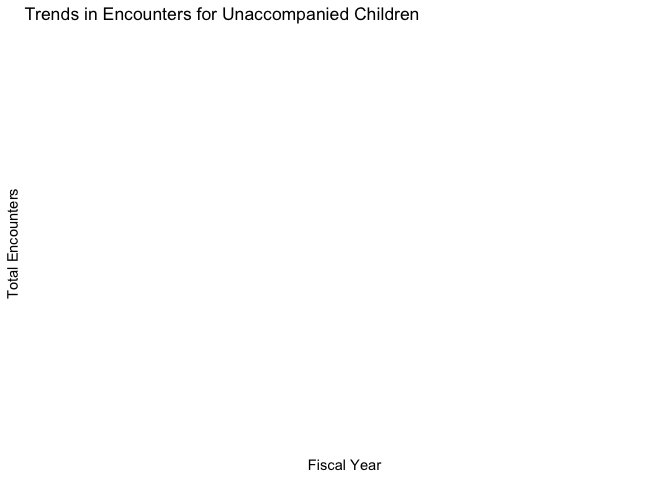

<!-- README.md is generated from README.Rmd. Please edit that file -->

# cbp.analysis

<!-- badges: start -->
<!-- badges: end -->

The goal of cbp.analysis is to analyzes U.S. Customs and Border
Protection (CBP) data.Through the analysis of cbp_resp data, we found
significant differences in the distribution of different demographic
characteristics (such as family unit members (FMUA), unaccompanied
children (UC)) in border encounters.

## Installation

You can install the development version of cbp.analysis like so:

``` r
remotes::install_github("ETC5523-2024/supplementary-assignment-Qiuyuan0055")
```

## Example

This is a basic example which shows you how to solve a common problem:
Example: Exploring Trends in Border Encounters by Demographic

``` r
library(cbp.analysis)
# Load the package
library(cbp.analysis)

# Load the dataset
data("cbp_resp", package = "cbp.analysis")

# Filter data for "Unaccompanied Children"
uc_data <- cbp_resp[cbp_resp$demographic == "Unaccompanied Children", ]

# Summarize total encounters by fiscal year
library(dplyr)
#> 
#> Attaching package: 'dplyr'
#> The following objects are masked from 'package:stats':
#> 
#>     filter, lag
#> The following objects are masked from 'package:base':
#> 
#>     intersect, setdiff, setequal, union
uc_summary <- uc_data %>%
  group_by(fiscal_year) %>%
  summarise(total_encounters = sum(encounter_count, na.rm = TRUE))

# Visualize the trend
library(ggplot2)
ggplot(uc_summary, aes(x = fiscal_year, y = total_encounters)) +
  geom_line(color = "blue", size = 1) +
  geom_point(size = 2) +
  theme_minimal() +
  labs(
    title = "Trends in Encounters for Unaccompanied Children",
    x = "Fiscal Year",
    y = "Total Encounters"
  )
#> Warning: Using `size` aesthetic for lines was deprecated in ggplot2 3.4.0.
#> ℹ Please use `linewidth` instead.
#> This warning is displayed once every 8 hours.
#> Call `lifecycle::last_lifecycle_warnings()` to see where this warning was
#> generated.
```

 \# Result

``` r
data("cbp_resp", package = "cbp.analysis")
uc_data <- cbp_resp[cbp_resp$demographic == "Unaccompanied Children", ]

uc_summary <- uc_data %>%
  group_by(fiscal_year) %>%
  summarise(total_encounters = sum(encounter_count, na.rm = TRUE))

ggplot(uc_summary, aes(x = fiscal_year, y = total_encounters)) +
  geom_line(color = "blue", size = 1) +
  geom_point(size = 2) +
  theme_minimal() +
  labs(
    title = "Trends in Encounters for Unaccompanied Children",
    x = "Fiscal Year",
    y = "Total Encounters"
  )
```


1.This example solves a common problem: how to analyze annual trends by
specific demographic categories. 2. The data were filtered and
summarized through filter and group_by, clearly showing the changing
trend of the target population. 3. The generated graph shows the total
number of encounters per fiscal year, and users can further infer trends
and potential causes based on the data.
